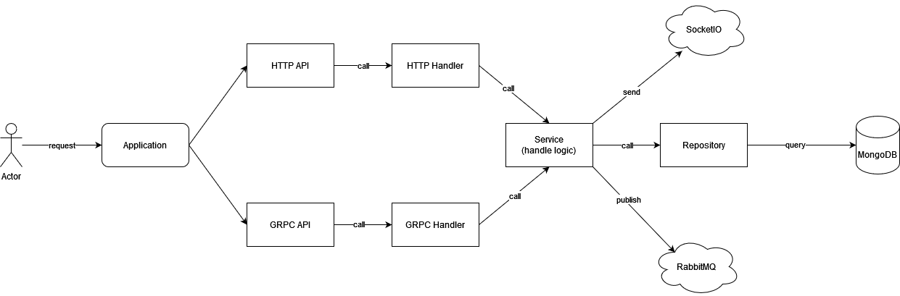

## `Development Guideline`
### Application Flow


### Setup new project from template

```bash
git clone --recurse-submodules git@192.168.205.151:vq2/vq2-go/go-template.git 
cp -r go-template new-module-folder
cd new-module-folder/
rm -rf .git
make set-module-name
make tidy
make tools
```

### Steps to define new Model

- We will use struct generate by protoc for DB Model, Grpc Response Object and Http Response Object (Http Response can be customed if needed)
- Example UserInfo in `user.proto`, we add tag bson for MongoDB object, we also can add validation tag, available validation tags can be view at (https://pkg.go.dev/github.com/go-playground/validator/v10)
```proto
message UserInfo {
    string ID = 1;//`json:"id,omitempty" bson:"_id,omitempty" `
    string UserName = 2;//`json:"user_name" bson:"user_name" validate:"required"`
    string FirstName = 3;//`json:"first_name,omitempty" bson:"first_name,omitempty"`
    string LastName = 4;//`json:"last_name,omitempty" bson:"last_name,omitempty"`
    int32 Age = 5;//`json:"age,omitempty" bson:"age,omitempty" validate:"gte=0,lte=130"`
    string Email = 6;//`json:"email" bson:"email" validate:"required,email"`
}
```
- Define new .proto file on `internal/gapi/proto`
- Run `make proto`

### Service struct

- Service defines in folder `internal/service`
- Service contains multiple Repository if we have multiple models
- Service name should be the same as module name (UserService just an example)
- Models's logic should be put in different file, each file contains 1 model

### Step to define new HTTP API router

- Create new folder in `interal/hapi/handlers` folder
- Define new handler and implement logic with Service struct
- Register handler with router on `func AttackAllRoutes`

### Step to define new GRPC API

- Define new handler and implement function on interface generated by protoc with Service struct
- Register new handler with pb service in `gapi/server.go`

### Important: We will use 1 service for all logic business, so we need replace user_service.go with our own service file.

### Compile and start application

- Run `make` or `make go-build`
- Start application with `make server` or `./bin/application_name start`

### Define swagger
- Add decralarative comment format like example in `internal/hapi/handlers/user/create_user.go`
- The body and object is the structs define in code
- Run `make swag` to generate doc
- Build and run application
- Access the swagger API doc at http://127.0.0.1:8080/swagger/index.html (8080 is default port for HTTP)

### References
[1] Retag plugin for protoc-go-gen https://github.com/qianlnk/protobuf/tree/master/protoc-gen-go/retag
